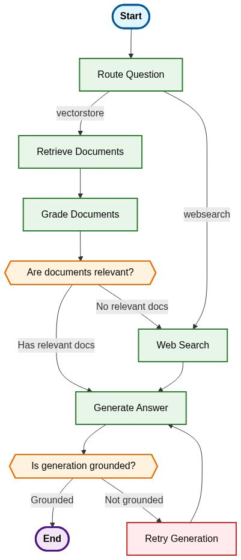
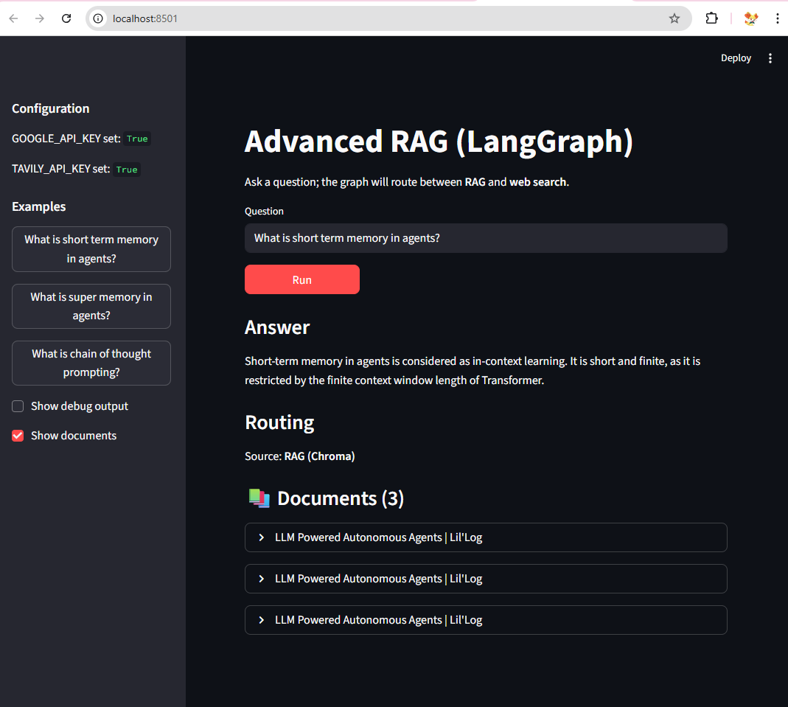

# Advanced RAG (Retrieval-Augmented Generation)

A sophisticated LangGraph-based RAG system that intelligently routes questions between vector store retrieval and web search, with advanced hallucination detection and document grading capabilities.





## 🚀 Features

- **Intelligent Question Routing**: Automatically determines whether to use vector store (RAG) or web search based on question content
- **Advanced Document Grading**: Evaluates retrieved documents for relevance before generation
- **Hallucination Detection**: Validates generated responses against source documents
- **Hybrid Search Strategy**: Combines vector store retrieval with web search for comprehensive coverage
- **Production-Ready Logging**: Comprehensive logging throughout the workflow
- **Comprehensive Testing**: Full test coverage with unit and integration tests
- **Type Safety**: Full type annotations and validation using TypedDict

## 🏗️ Architecture

The system uses LangGraph to create a stateful workflow with the following components:

### Workflow Overview

1. **Question Routing**: Routes incoming questions to either vector store or web search
2. **Document Retrieval**: Fetches relevant documents from vector store (if applicable)
3. **Document Grading**: Evaluates document relevance to the question
4. **Web Search Fallback**: Performs web search if no relevant documents are found
5. **Answer Generation**: Generates responses using retrieved context
6. **Hallucination Detection**: Validates that generated answers are grounded in source documents
7. **Retry Mechanism**: Retries generation if hallucination is detected

### Key Components

- **StateGraph**: Manages the workflow state and transitions
- **Node Functions**: Individual processing steps (retrieve, grade, generate, etc.)
- **Conditional Edges**: Dynamic routing based on document relevance and generation quality
- **Chains**: LangChain components for specific tasks (generation, grading, routing)

## 📋 Prerequisites

- Python 3.8+
- Google Gemini API key (for LLM)
- Tavily Search API key (for web search)
- Vector store with embedded documents

## 🛠️ Installation

1. **Clone the repository**:
   ```bash
   git clone https://github.com/yourusername/Advanced-RAG.git
   cd Advanced-RAG
   ```

2. **Create virtual environment**:
   ```bash
   python -m venv .venv
   source .venv/bin/activate  # On Windows: .venv\Scripts\activate
   ```

3. **Install dependencies**:
   ```bash
   pip install -r requirements.txt
   ```

4. **Set up environment variables**:
   Create a `.env` file in the root directory:
   ```env
   # Required API Keys
   GOOGLE_API_KEY=your_gemini_api_key_here
   TAVILY_API_KEY=your_tavily_api_key_here
   
   # Optional Configuration
   MODEL_NAME=gemini-2.0-flash-lite
   WEB_SEARCH_MAX_RESULTS=3
   LOG_LEVEL=INFO
   ```

## 🚀 Usage

### Basic Usage

```python
from graph.graph import app

# Ask a question
result = app.invoke({"question": "What is chain of thought prompting?"})
print(result["generation"])
```

### Running the Main Application

```bash
python main.py
```

### Running the Streamlit App

```bash
streamlit run app.py
```

The Streamlit UI calls the same LangGraph `app` as `main.py`, and shows:
- the final answer (`generation`)
- whether the graph used **RAG** or **web search** (`web_search` flag)
- optionally, the retrieved `documents` and full raw state for debugging

## 🐳 Docker (local)

Build and run the container locally:

```bash
docker build -t arag-streamlit:local .
docker run --rm -p 8501:8501 arag-streamlit:local
```

Open `http://localhost:8501`.

## ☁️ AWS Elastic Beanstalk (Docker image from Docker Hub)

### Push image to Docker Hub

```bash
docker tag arag-streamlit:local kochurovskyi/arag-streamlit:latest
docker push kochurovskyi/arag-streamlit:latest
```

### Deploy from AWS Console (no AWS CLI required)

1. **Elastic Beanstalk → Create application**
   - Environment: **Web server environment**
   - Platform: **Docker**
2. Upload an application zip that contains **only** `Dockerrun.aws.json` at the root:

```json
{
  "AWSEBDockerrunVersion": "1",
  "Image": { "Name": "kochurovskyi/arag-streamlit:latest", "Update": "true" },
  "Ports": [{ "ContainerPort": "8501" }]
}
```

3. After the environment is green, open the EB URL (example):
   `http://arag-streamlit.eu-central-1.elasticbeanstalk.com/`

### Required environment variables (Elastic Beanstalk)

Elastic Beanstalk → Environment → **Configuration → Software → Environment properties**:

- `GOOGLE_API_KEY` (or `GEMINI_API_KEY`)
- `TAVILY_API_KEY` (optional, only if you want web search)

Optional:
- `DIRECT_LLM_ONLY=1` (force plain LLM, skip RAG + web)
- `MAX_RETRIES=3`

### Running Tests

```bash
# Run all tests
pytest tests/ -v

# Run specific test files
pytest tests/test_chains.py -v
pytest tests/test_integration.py -v
```

## 📁 Project Structure

```
Advanced-RAG/
├── app.py                    # Streamlit UI (calls graph.graph:app)
├── graph/
│   ├── __init__.py
│   ├── graph.py              # Main LangGraph workflow definition
│   ├── state.py              # GraphState TypedDict definition
│   ├── logging_config.py     # Logging configuration
│   ├── chains/               # LangChain components
│   │   ├── __init__.py
│   │   ├── generation.py     # RAG generation chain
│   │   ├── retrieval_grader.py  # Document relevance grader
│   │   ├── hallucination_grader.py  # Hallucination detector
│   │   └── router.py         # Question routing logic
│   └── nodes/                # LangGraph node functions
│       ├── __init__.py
│       ├── retrieve.py       # Document retrieval
│       ├── grade_documents.py # Document grading
│       ├── generate.py       # Answer generation
│       └── web_search.py     # Web search functionality
├── tests/                    # Test suite
│   ├── __init__.py
│   ├── test_chains.py        # Unit tests for chains
│   └── test_integration.py   # Integration tests
├── ingestion/                # Document ingestion (external)
├── config.py                 # Configuration management
├── main.py                   # Main application entry point
├── requirements.txt          # Python dependencies
├── .env.example             # Environment variables template
├── graph.mmd                # Mermaid diagram source
├── graph.png                # Workflow visualization
├── screenshot_streamlit.png  # Streamlit UI screenshot
└── README.md                # This file
```

## 🔧 Configuration

The system is highly configurable through environment variables:

| Variable | Default | Description |
|----------|---------|-------------|
| `GOOGLE_API_KEY` | Required | Google Gemini API key |
| `TAVILY_API_KEY` | Required | Tavily Search API key |
| `MODEL_NAME` | `gemini-2.0-flash-lite` | LLM model to use |
| `WEB_SEARCH_MAX_RESULTS` | `3` | Maximum web search results |
| `LOG_LEVEL` | `INFO` | Logging level |
| `MAX_RETRIES` | `3` | Maximum generation retries |

## 🧪 Testing

The project includes comprehensive testing:

### Test Coverage
- **Unit Tests**: Individual chain components
- **Integration Tests**: End-to-end workflow testing
- **Error Handling**: Edge case and error scenario testing

### Running Tests
```bash
# Run all tests with verbose output
pytest tests/ -v

# Run with coverage report
pytest tests/ --cov=graph --cov-report=html

# Run specific test categories
pytest tests/test_chains.py -v      # Chain unit tests
pytest tests/test_integration.py -v # Integration tests
```

## 📊 Performance

- **Response Time**: ~2-5 seconds for typical queries
- **Accuracy**: High relevance through document grading
- **Reliability**: Robust error handling and retry mechanisms
- **Scalability**: Designed for production deployment

## 🔍 Workflow Details

### 1. Question Routing
The system first determines whether a question should be answered using:
- **Vector Store (RAG)**: For questions about AI, machine learning, prompt engineering, etc.
- **Web Search**: For general knowledge, current events, or topics not in the vector store

### 2. Document Processing
When using RAG:
- Retrieves relevant documents from vector store
- Grades each document for relevance to the question
- Triggers web search if no relevant documents are found

### 3. Answer Generation
- Generates responses using retrieved context
- Validates that answers are grounded in source documents
- Retries generation if hallucination is detected

### 4. Quality Assurance
- Hallucination detection ensures factual accuracy
- Document grading maintains relevance
- Comprehensive logging for debugging and monitoring

## 🛡️ Error Handling

The system includes robust error handling:
- Graceful fallbacks for API failures
- Retry mechanisms for transient errors
- Comprehensive logging for debugging
- State validation to prevent crashes

## 📈 Monitoring

Built-in logging provides insights into:
- Question routing decisions
- Document retrieval and grading results
- Generation quality and retry attempts
- Performance metrics and timing

### Example Log Output

**RAG Workflow (Vector Store Path):**
```
2025-10-09 16:00:33,938 - arag.graph - INFO - Routing question
2025-10-09 16:00:34,861 - arag.graph - INFO - Route question to RAG (vectorstore)
2025-10-09 16:00:35,598 - arag.graph - INFO - Route question to RAG (vectorstore)
2025-10-09 16:00:35,599 - arag.graph.retrieve - INFO - Retrieving documents
2025-10-09 16:00:36,136 - arag.graph.retrieve - INFO - Retrieved 3 documents
2025-10-09 16:00:36,136 - arag.graph.grade_documents - INFO - Checking document relevance to question
2025-10-09 16:00:38,139 - arag.graph.grade_documents - INFO - Graded 3 documents, 3 relevant
2025-10-09 16:00:38,140 - arag.graph - INFO - Assessing graded documents
2025-10-09 16:00:38,140 - arag.graph - INFO - Decision: Generate response
2025-10-09 16:00:38,141 - arag.graph.generate - INFO - Generating response
2025-10-09 16:00:39,067 - arag.graph.generate - INFO - Generated response length: 150 characters
2025-10-09 16:00:39,067 - arag.graph - INFO - Checking hallucinations
2025-10-09 16:00:39,907 - arag.graph - INFO - Generation is grounded in documents
----------------------
Question:  What is short term memory in agents?
Source - RAG
Short-term memory in agents is utilized for in-context learning. It is considered a way for the model to learn. This is related to prompt engineering.
------------------------
```

**Web Search Workflow (Fallback Path):**
```
2025-10-09 16:00:39,909 - arag.graph - INFO - Routing question
2025-10-09 16:00:40,668 - arag.graph - INFO - Route question to RAG (vectorstore)
2025-10-09 16:00:41,287 - arag.graph - INFO - Route question to RAG (vectorstore)
2025-10-09 16:00:41,288 - arag.graph.retrieve - INFO - Retrieving documents
2025-10-09 16:00:41,625 - arag.graph.retrieve - INFO - Retrieved 3 documents
2025-10-09 16:00:41,627 - arag.graph.grade_documents - INFO - Checking document relevance to question
2025-10-09 16:00:43,916 - arag.graph.grade_documents - INFO - Graded 3 documents, 0 relevant
2025-10-09 16:00:43,916 - arag.graph - INFO - Assessing graded documents
2025-10-09 16:00:43,917 - arag.graph - INFO - Decision: Not all documents are relevant to question, include web search
2025-10-09 16:00:43,917 - arag.graph.web_search - INFO - Performing web search
2025-10-09 16:00:46,220 - arag.graph.web_search - INFO - Web search completed, found 3 results
2025-10-09 16:00:46,221 - arag.graph.generate - INFO - Generating response
2025-10-09 16:00:47,028 - arag.graph.generate - INFO - Generated response length: 376 characters
2025-10-09 16:00:47,028 - arag.graph - INFO - Checking hallucinations
2025-10-09 16:00:47,836 - arag.graph - INFO - Generation is grounded in documents
----------------------
Question:  What is super memory in agents?
Source - Web
Supermemory is a universal memory API for AI apps that builds a knowledge graph based on the data it processes and personalizes the context for the users. It is described as a universal AI memory layer that keeps projects, prompts, and context synced across every AI IDE and LLM. The core idea is to create a centralized memory store accessible by various AI Agent interfaces.
------------------------
```


## 📄 License

This project is licensed under the MIT License - see the [LICENSE](LICENSE) file for details.

## 🙏 Acknowledgments

- [LangGraph](https://langchain-ai.github.io/langgraph/) for the workflow framework
- [LangChain](https://python.langchain.com/) for the LLM integration
- [Tavily](https://tavily.com/) for web search capabilities
- [Google Gemini](https://ai.google.dev/) for the language model


---

**Built with ❤️ using LangGraph and LangChain**